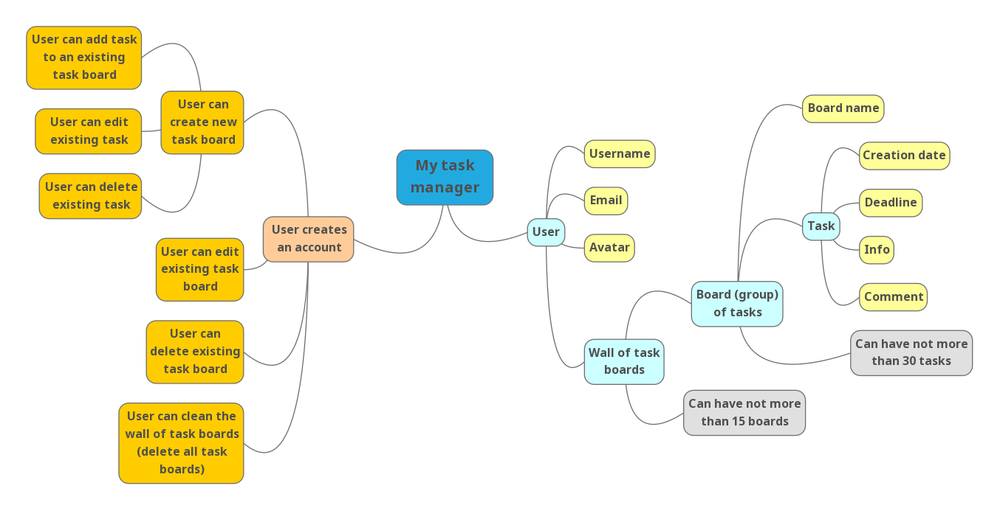

Task Manager
=====================
Проект, созданный в рамках [курса РИП](https://github.com/iu5team/iu5web-fall-2019) на ИУ5.

### Отчеты к лабораторным работам
[Лабораторная работа №1](docs/lab1.pdf)

Описание
---------------------
Пользователь заводит профиль, добавляя личные данные: никнейм, email, аватар. У пользователя есть стена задач, где он может создавать новые группы задач (доски) и добавлять в них задачи. На стене может быть не больше 15 досок, на доске может быть не больше 30 задач. У задачи, помимо принадлежности к доске, есть дата создания, срок выполнения, сама информация о задаче и комментарий.

#### Mind Map

#### Концептуальная карта
